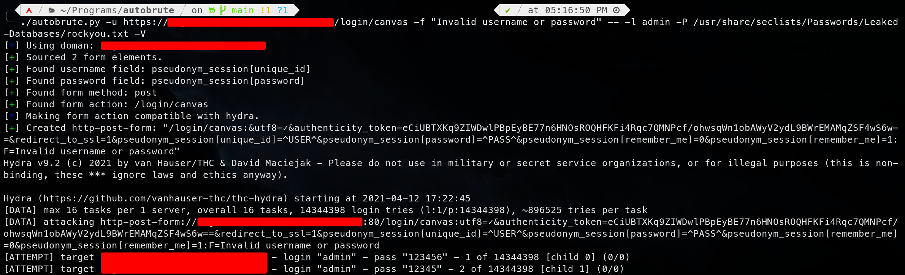

# AutoBrute.py | The Easy Hydra Formatter

Autobrute is a script that automates the time consuming process of forming a `http-post-form`. If you are hacking CTFs, it is usually a good idea to brute force any login page you come across. Most of the time, I would not want to do this process because it was just so boring to do. Now with autobrute, all you have to do is run one command.

## Installation
To install autobrute, just run the command below.
```
pip3 install -r requirements.txt
```

## Usage
To use autobrute, you need to specify two arguments. First, you need to specify the URL to the login page that will be brute forced. Next, specify the error message that is displayed for incorrect credentials. Here is an example of running autobrute:



As you can see, after specifying the url with `-u` and the failure condition with `-f`, you can use `--` to incorporate hydra arguments. 
